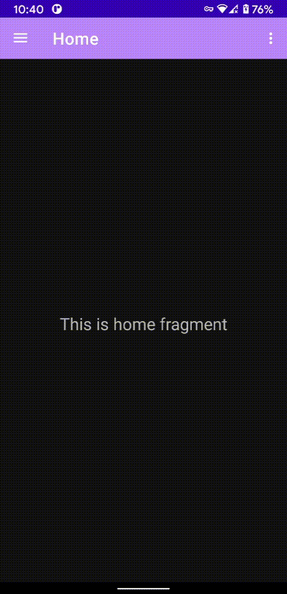
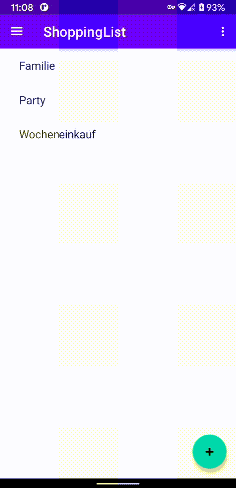
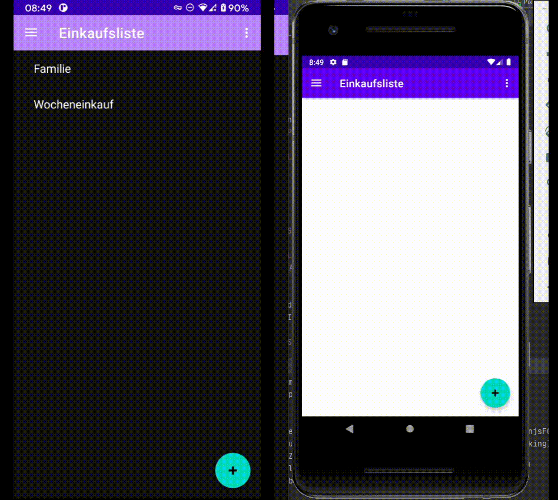

# Haushaltsapp
Diese README ist unsere Projektdokumentation.


1. Einleitung
2. Planung
    1. Organisation
    2. x

3.  Werkzeuge für die Entwicklung
    1. Versionsverwaltung
    2. x

4. Architektur

5. Firebase zeugs bla bla
   1. Sicherheit
6. Features
    1. Chat
    2. Einkaufsliste
    3. Finanzen
    4. Vorrat
7. Projektjournal
8. Fazit


### 3.1 Versionsverwaltung
Für die Versionsverwaltung benutzen wir Git. Wir haben uns darauf geeinigt nur auf dem Master branch zu arbeiten da unsere Aufgabenbereiche Modular aufgeteilt sind. Als Plattform für unser Remote Repository benutzen wir Github da es kostenlos ist. Die Handhabung ist recht leicht und es gibt uns auch die Möglichkeit Workflows zu benutzen. Ein Workflow ist ein automatisierter Prozess der zum Beispiel überprüft ob unsere App kompiliert.   

### 4 Architektur
#### 4.1 Packete nach Feature nicht Schichten
Es gibt 2 Hauptgruppen bei der Aufteilung eines Projektes. Die eine ist die Aufteilung der Packete nach Schichten, also jeweils ein Packet für alle `Activitiy`,`Fragment`, `ViewModel`, `Model` usw. Dagegen gibt es die Aufteilung nach Features. Also ein Packet pro Feature, wo jeweils alle zum Feature relevanten Klassen enthalten sind und somit `Activitiy`,`Fragment`, `ViewModel` und `Model` alle in einem Packet zusammen vermischt sein können.

Wir haben uns für die Aufteilung nach Feature entschieden. Es gruppiert Klassen, die eng mit einander arbeiten, zusammen und verringert so den "mentalen weg", den ein Entwickler durch das Dateisystem laufen muss, um zu den dazugehörigen Klassen zu gelangen.

Da wir auch seperate jeweils an einen Feature arbeiten, hat jeder sein eigenes Packet und kann somit niemand anderen in quere kommen.

Eine textuelle representation kann man auf Windows mit dem Befehl `tree` erhalten (TODO neu generieren vor abgabe)
```
└───haushaltsapp
    ├───authentification
    ├───chat
    ├───home
    ├───shopping
    ├───slideshow
    ├───supply
    ├───types
    ├───user
    └───utils
```

#### 4.2 Model View ViewModel (MVVM)
Ein sehr verbreitetes Architekturmodell in der nativen Android Entwicklung ist das von MVC abgewandelte MVVM Modell. Es schreibt eine Aufteilung der Verantwortlichkeiten vor und sorgt damit für eine ingesamt bessere Codebasis. Die Verantwortlichkeiten sind wie folgt aufgeteilt:

1. __Model__: Es beinhaltet die Daten, deren Format und die Zugriffslogik.
2. __View__: Es beinhaltet die graphische Oberfläche. Hier wird das Layout beschrieben, sowie das Verhalten bei einer Userinteraktion.
3. __ViewModel__: Es dient als eine Abstraktionsschicht zwischen Model und View. Es stellt alle business Funktionalität zur Verfügung, die die View benötigt. Zudem kann es den Zustand der View abspeichern.

Bei uns in der App ist:
1. das __Model__ die Integration mit Firebase, welche durch die Repository Klassen realisiert sind.
2. die __View__ die Beschreibung der Layouts durch die XML Dateien und das Interaktionsverhalten, welche durch die Fragment und Activity Klassen realisiert sind.
3. das __ViewModel__ die Abstraktionschicht zwischen Model und View und stellt alle nötigen business Funktionalitäten zur Verfügung. Dabei wird das `reactive pattern` verwendet, welches durch `LiveData` realisiert wird. Funktionen haben als Rückgabetyp `LiveData`, an welchen man einen Listener hinzufügen kann. Bei einem Event, also Daten wurden erfolgreich geladen, bzw haben sich verändert, kann die View reagieren und sich anpassen. Hierfür gibt es von Firebase auch Bibliotheken, die die Arbeit mit `RecyclerView`, also Listen, abnimmt. Es dient zusätzlich als Zustandspeicher, womit man über Fragmente hinweg Daten austauschen kann

Die Reaktive Programmierung ist hierbei sehr wichtig, weil man ansonsten, durch das Laden der Daten, den Hauptthread blockiert, welcher auch der UI Thread genannt wird. Somit würde die komplette UI einfrieren bis die Daten geladen worden sind. Im schlimmsten Fall würde Android auch die App beenden.

Das abspeichern des Zustandes in ViewModel ist wichtig, das man zb durch das drehen des Handys um 90°, das Fragement zerstört und neu erstellt wird. Somit geht jeglicher Zustand verloren, welcher nur im Fragment vorhanden ist.

Durch diese Aufteilung der Verantwortlichkeiten, kann man Code teilen zwischen Komponenten. Zudem haben erfahrene Entwicker einen leichteren Einstieg in neue MVVM Projekte, da sie wissen, wo sie nach bestimmten Verantwortlichkeiten suchen müssen. 

Ein weitere Vorteil, welcher hier aber nicht umgesetzt wurde, ist dass man die einzelnen Schichten einfacher testen kann. Indem man jeweils für die tiefer liegende Schicht ein Mock erstellt und diese per `Dependecy Injection` in die Klassen injektiert, kann man jede Schicht in isolation testen.

Ein kleines Beispiel hierfür sind die Klassen im `authentification` Packet, hier wurden nicht relevante Sachen gekürzt:
``` java
// java
public class AuthRepository {

    private static final String TAG = AuthRepository.class.getCanonicalName();

    private final FirebaseAuth auth = FirebaseAuth.getInstance();

    public LiveData<Boolean> signIn(String email, String password) {
        MutableLiveData<Boolean> result = new MutableLiveData<>();

        auth.signInWithEmailAndPassword(email, password)
            .addOnCompleteListener(task -> {
                if (task.isSuccessful()) {
                    Log.i(TAG, "signIn successful");
                } else {
                    Log.w(TAG, "signIn failed", task.getException());
                }

                result.setValue(task.isSuccessful());
            });

        return result;
    }
}
```

``` java
public class AuthViewModel extends ViewModel {

    private final AuthRepository repository = new AuthRepository();

    public LiveData<Boolean> signIn(String email, String password) {
        return repository.signIn(email, password);
    }
}
```

``` java
public class LoginActivity extends AppCompatActivity {
    private AuthViewModel authViewModel;

    @Override
    protected void onStart() {
        authViewModel = new ViewModelProvider(this).get(AuthViewModel.class);
    }

    @Override
    protected void onCreate(Bundle savedInstanceState) {
        btnLogin.setOnClickListener(view -> {
            String tempEmail = email.getText().toString().trim();
            String tempPass = passwort.getText().toString().trim();

            authViewModel.signIn(tempEmail, tempPass)
                .observe(this, success -> {
                    if (Boolean.TRUE.equals(success)) {
                        Toast.makeText(LoginActivity.this, "done", Toast.LENGTH_SHORT).show();
                        navigateToMain();
                    } else {
                        Toast.makeText(LoginActivity.this, "failed", Toast.LENGTH_SHORT).show();
                    }
                });
        });
    }
}

```

#### 4.4 Fragmente wiederverwenden
Ein Grund für die Verwendung von Fragmenten über Activities, ist dass man mehrer Fragment in einer Activity darstellen kann und somit zwischen verschiedenen Features einfach teilen kann. Mehrere unserer Features haben die Möglichkeit User zu einer Gruppe zuzuweisen und müssen diese entsprechend auch anzeigen. Dafür gibt es ein Packet `user` in welchen diese Funktionalität implementiert ist und aktuell von der Einkaufsliste und dem Finanz Feature verwendet wird.

Dabei werden verwenden beide Features einen Host Fragment mit `ViewPager`, welche mehrere Kinderfragmente als Tabs darstellt, zwischen denen man per wischen wechseln kann. Dieses Host Framgent teilt den Kinderfragmenten die nötigen Daten mit, damit dieser die User abfragen und darstellen kann. Es ist dabei nicht komplett ohne Anpassung wiederverwendbar, mann muss Teil der Funktionalität für neue Features noch implementieren, besonders in Bezug auf die Datenbank (Siehe switch-case in ` UserViewModel`). Insgesamt ist es aber eine sehr viel bessere Lösung, da die UI Definition und das UI Verhalten somit zentral für alle Features nur einmal implementiert werden muss.

In einem `FragmentStateAdapter` definiert man die Anzahl der Tabs und welche Fragmente an welcher Position sind:
``` kotlin
// Kotlin
class ShoppingDetailPagerAdapter(fragment: Fragment) : FragmentStateAdapter(fragment) {
    override fun createFragment(position: Int): Fragment {
        return when (position) {
            0 -> ShoppingDetailEntriesFragment()
            1 -> UserFragment()
            2 -> UserAddFragment()
            else -> throw IllegalArgumentException("More entries in pager than expected")
        }
    }

    override fun getItemCount(): Int {
        return 3
    }
```
Bei uns gibt es auch noch ein `FinanceViewPageAdapter`, welcher das `UserFragment` und das `UserAddFragment` auch verwendet.


#### 4.5 Kommunikation per ViewModel
In 4.4 wurde erwähnt, dass das Host Fragment, den Kinderfragmenten die Daten mitteilen muss. Dies geschiet sehr pragmatisch, indem das Host Fragment einen Setter aufruft auf dem ViewModel und das Kind Fragment den gesetzten Wert dann verwenden kann. Es muss aber sicher gestellt werden, dass beide Fragmente auf der gleichen Instanz eines ViewModel arbeiten. 

Zum erstellen eines ViewModel wird im ersten Schritt die Funktion [ViewModelProvider(ViewModelStoreOwner owner)](https://developer.android.com/reference/androidx/lifecycle/ViewModelProvider#ViewModelProvider(androidx.lifecycle.ViewModelStoreOwner)) aufgerufen. Hier muss dann im Host und Kind Fragment der gleiche owner übergeben werden, welches das Host Fragment ist. 

``` kotlin
//kotlin, host
class ShoppingDetailFragment : Fragment() {
    private lateinit var userViewModel: UserViewModel

    override fun onCreate(savedInstanceState: Bundle?) {
        userViewModel = ViewModelProvider(this).get(UserViewModel::class.java)
    }
}
```

``` java
//java, kind
public class UserFragment extends Fragment {
    private UserViewModel userViewModel;

    @Override
    public void onCreate(Bundle savedInstanceState) {
        userViewModel = new ViewModelProvider(requireParentFragment()).get(UserViewModel.class);
    }
}
```

Danach muss das Host Fragment die Identifikatoren in das ViewModel injektieren, mit welchen dann gearbeitet wird.
``` kotlin
//kotlin, host 
class ShoppingDetailFragment : Fragment() {
    private lateinit var userViewModel: UserViewModel

    override fun onCreateView(
        inflater: LayoutInflater,
        container: ViewGroup?,
        savedInstanceState: Bundle?,
    ): View? {
        shoppingViewModel.shoppingList.observe(viewLifecycleOwner,
            { detail: ShoppingListDetail ->
                userViewModel.setSource(UserSource.SHOPPING)
                userViewModel.setId(detail.id)
            })
    }
}
```

``` java
//java, kind
public class UserViewModel extends ViewModel {

 public LiveData<List<UserSummary>> getMembers() {
  private Query getQuery() {
      Query query = null;
      switch (source) {
          case SHOPPING:
              query = repository.getShoppingListMembers(id);
              break;
          case FINANCE:
              query = repository.getBudgetMembers(id);
              break;
      }
      return query;
    }
}

```

Hier sieht man dass es noch nicht perfekt ist, da man mit einem switch case jeden Fall in der geteilten Komponente seperate behandeln muss. Aber insgesamt ist es ein sehr große Verbesserung im Vergleich zu wenn man die Klassen kopiert. Mit der jetzigen Variente muss man nur im Host die Setter aufrufen und die Methoden mit switch case für den eigenen Fall implementieren.

### 5 Firebase
#### 5.1 Sicherheit
Firebase schützt in der Datenbank abgelegte Daten nicht. Zumindest nicht von alleine bla bla bla


Default Regeln

    rules_version = '2';
    service cloud.firestore {
    match /databases/{database}/documents {
     match /{document=**} {
         allow read, write: if 
      	    request.time < timestamp.date(2021, 7, 1);
        }
       }
      }

Die Default Regeln sind nur für die Entwicklung gedacht da jedes Dokument gelesen und geändert werden kann. Die Datenbank ist nicht geschützt.


Bsp

    match /Budget/{itemId}{

      allow read: if isOwner(resource.data) &&
        isSignedIn();

      allow create: if isValidBudget(request.resource.data) &&
        isOwner(request.resource.data) &&
        checkKeys();

      allow update: if isValidBudget(request.resource.data) &&
        isOwner(request.resource.data) &&
        isOwner(resource.data) &&
        checkKeys();

      allow delete: if isOwner(resource.data);

      // FUNCTIONS
      function isSignedIn() {
        return request.auth != null;
      }
  
      function isOwner(budget) {
        return request.auth.uid == budget.;
      }
  
      function isValidBudget(budget) {
        return (
          // budget.id
          budget.id is string &&
          budget.id != '' 
        );
      }

      function checkKeys() {
        let requiredFields = ['id'];
        return request.resource.data.keys().hasAll(requiredFields)
      }
    }

### 6 Features
#### 6.2 Einkaufsliste
Hier werden alle Einkaufslisten angezeigt, auf die man Zugriff hat. Das bedeutet Einkaufslisten, die man selber erstellt hat, aber auch welche zu denen man von anderen hinzugefügt wurde. Bei einem Klick auf einen Eintrag gelangt man zur Detailansicht der jeweiligen Einkaufsliste und mit einen Klick auf das + recht unten, erscheint ein Dialog mit dem man eine weitere Einkaufsliste erstellen kann.  
Falls man sehr viele Einträge hat, kann man nach unten scrollen und diese anzeigen



In der Detailansicht sieht man alle Informationen zu einer Einkaufsliste einsehen.  
Man sieht die einzelnen Einträge und kann am haken direkt sehen, welche schon erledigt sind. Man kann selber neue Einträge hinzufügen und als erledigt markieren.  
Weitere Teilnehmer können hinzugefügt werden und somit diesen Zugriff zur Einkaufsliste gewähren. Mit diesen Teilnehmern teilt man dan die Einkaufsliste und kann Live sehen, falls jemand anderes etwas abhakt.

Ist man fertig kann man die Liste leeren und wiederverwenden oder komplett löschen.


Hier ist noch eine Darstellung der Live updates.


#### 9.99 Wie man dieses Projekt baut
1. Log in [Firebase Konsole](https://console.firebase.google.com/)
2. Neues Projekt anlegen
3. Neue Datenabnk anlegen (Bild folgt)
4. Authentifizierung hinzufügen (Bild folgt)
5.Firebase mit dem Android App Projekt hinzufügen (Bild folgt)
6.----
7. google-services.json in app/ folder einfügen
   
   
   
   

