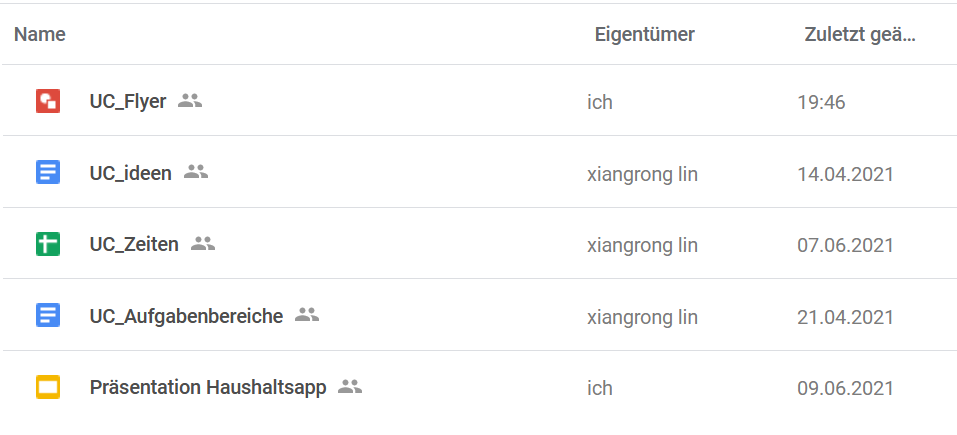
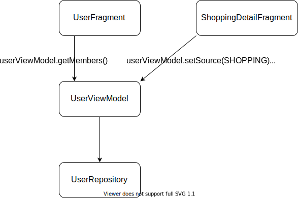
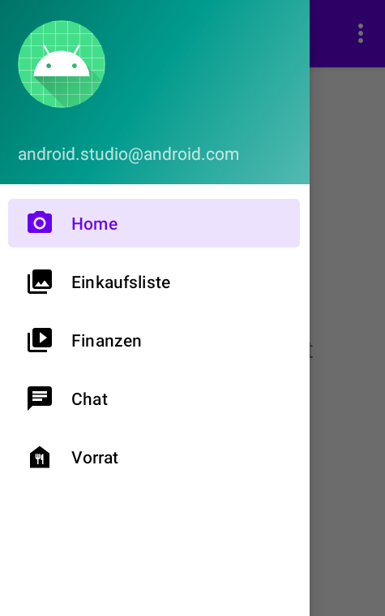
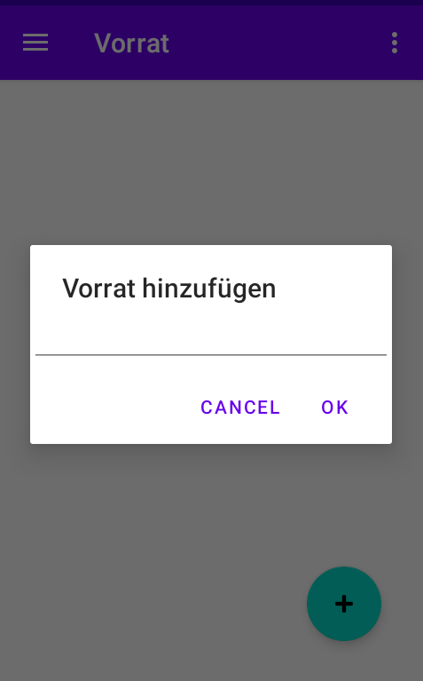
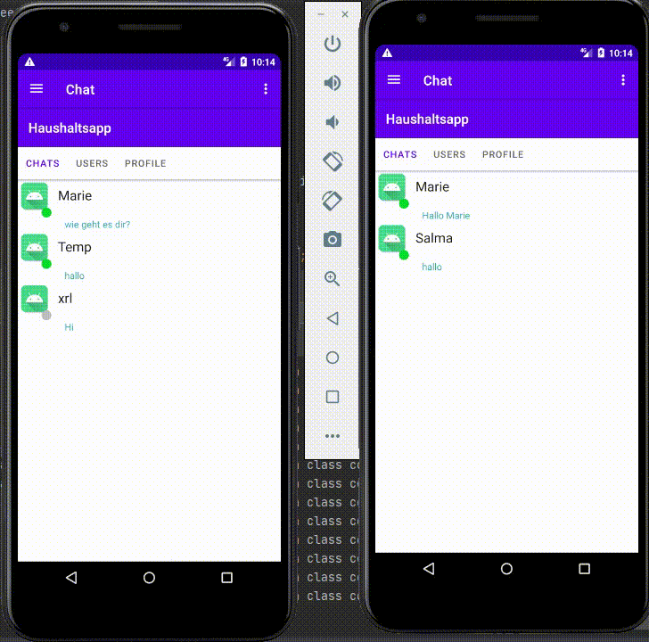
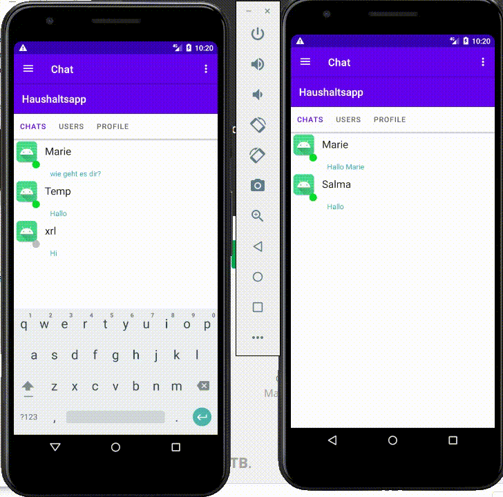

# Haushaltsapp
Diese README ist unsere Projektdokumentation.


1. Einleitung
2. Planung
    1. Zielsetzung
    2. Organisation
    3. Dokumentenverwaltung

3.  Werkzeuge für die Entwicklung
    1. Versionsverwaltung
    2. x

4. Architektur

5. Firebase zeugs bla bla
   1. Sicherheit
   2. Datenmodell
6. Features
    1. Registrierung & Login
    2. Chat
    3. Einkaufsliste
    4. Finanzen
    5. Vorrat
8. Projektjournal
9. Fazit
10. Quellenverzeichnis


## 1 Einleitung
„Im 21. Jahrhundert wird die technologische Revolution das Alltägliche, Kleine und Unsichtbare sein.“ - Mark Weiser, 1952-1999

Mark Weiser hatte schon 1988 die Vision den Menschen bei seinen Tätigkeiten mit immer kleiner werdenden Computern Hilfestellung zu leisten. Erstmals verwendete er den Begriff Ubiquitous Computing mit der Idee, dass „intelligente Gegenstände“ den Menschen unmerklich unterstützen. 

Damit hatte Mark Weiser eine erste Idee, von dem, was heute fast schon selbstverständlich scheint. In der gegenwärtigen dritten Computer-Ära des Ubiquitous Computing sind für jede Person viele Computer eingebettet in die Umgebung. Alltägliche Aufgaben werden unterstützt durch „kleine Computer“.

Im Rahmen unseres Projektes für das Modul „Ubiquitous Computing“ setzt genau hier unsere Projektidee an. Der alltägliche Haushalt soll erleichtert werden mit einer Haushaltsapp. 

Im Folgenden legen wir dar, wie unsere App entstanden ist und führen die technischen Hintergründe aus.

# 2 Planung
## 2.1 Zielsetzung
### Fachlich
Insbesondere die Organisation von Lebensmitteln steht bei der Haushaltsapp im Fokus. Dies bedeutet, dass Einkaufslisten geplant werden können verknüpft mit einem bestimmten zur Verfügung stehenden Budget. Da in einem Haushalt häufig mehrere Personen verantwortlich für die Organisation der Einkäufe sind, ist es wichtig, dass Listen mit anderen Haushaltsmitgliedern geteilt werden können. Auch Freunde und Nachbarn können so Gegenstände auf einer Einkaufsliste hinzufügen. Gleichzeitig soll der vorhandene Vorrat gespeichert werden und aktualisiert werden. So steht eine Übersicht der vorhandenen Lebensmittel zur Verfügung. Auch soll das Mindesthaltbarkeitsdatum festgehalten werden und die App meldet, sobald ein Produkt abgelaufen ist. Für das zur Verfügung stehende Budget werden die Ein- und Ausgaben festgehalten. Ausgaben können geplant werden. Auch in diesem Bereich ist es möglich ein bestimmtes Budget mit anderen Haushaltsmitgliedern, Freunden und Nachbarn zu teilen. Gleichzeitig ist es möglich eine individuelle Planung zu erstellen.
Als mögliche Zusatzoptionen haben wir als Ziel das Mindesthaltbarkeitsdatum mit OCR zu scannen und per Barcode Produkte zu speichern. Zusätzlich ist es eine Option einen Chat zu erstellen, so dass auch eine Kommunikation bezüglich des Einkaufs ermöglicht wird.

### Technisch
2 der 4 Teammitglieder waren bereits mit der Android Entwicklung und auch der Entwicklung im allgemeinen vertraut und haben deshalb ihren Fokus auf technische Aspekte gelegt. Hier wollten wir uns mit neuen Technologien vertraut machen.   
Mit dem vermehrter Angebot von "X as a Service", ist eine Erfahrung mit Firebase und somit "Backend as a Service" sehr wertvoll.
Hier wollten wir die Einschränkungen und auch Möglichkeiten kennenlernen, damit wir dies zukünftig für weitere Projekte evaluieren können.  
Direkt mit gebündelt in Firebase ist auch NoSql, da sowohl die Realtime Database als auch der Cloud FireStore NoSql Datenbanken sind.

Für die beiden Teammitglieder, die neu in die Android Entwicklung einsteigen, ist es das Kennenlernen der nativen Android Entwicklung mit Java. Im Besonderen bedeutet dies die einzelnen Elemente von Android Studio kennen zu lernen und eine Bedienoberfläche zu entwerfen mit der entsprechenden Klassenhierarchie. Neben der Arbeit in der Android Entwicklung war es das Ziel die Arbeit mit Firebase kennenzulernen, die Struktur zu verstehen und in dem Projekt zu verwenden.

### 2.2 Organisation 
Diese Zielsetzung führte in den Start unseres Projektes. Ein Mal in der Woche waren Treffen via Zoom fest eingeplant. Hier wurde der Stand des Projektes und etwaige Probleme besprochen. Des weiteren wurden neue Aufgaben für die nächste Woche verteilt. Auf diese Weise konnte jeder über die Woche verteilt eigenständig arbeiten und seine Zeit planen.
Bei Bedarf fanden weitere Treffen über Zoom statt. Die Kommunikation lief weitgehend über Discord.

Zunächst haben wir die Aufgaben nach der "Schicht" aufgeteilt. Also eine typische Weise Codebasen zu strukturieren, ist in eine Datenschicht, Logikschicht und UI-Schicht. Dies hat sich aber bereits nach einer Woche als sehr schlecht erwiesen, da wir insgesamt zu wenig über die Android Entwicklung mit Firebase wussten. Stattdessen war jedes Teammitglied für ein Feature zuständig, aber dann auf allen Schichten

### 2.3 Dokumentenverwaltung
Für das Projekt wurden verschiedene gemeinschaftliche Dokumente angelegt. Hierzu gehören die Projektidee, die Aufgabenaufteilung mit zeitlichen Zielsetzungen, ein Journal mit der Erfassung der individuellen Arbeitszeiten und letztendlich eine Präsentation. Diese Dokumente wurden in Google Drive erstellt. Google Drive stellt ein Office-Softwarepaket zur Verfügung, das das Teilen von Dateien und das gemeinsame Bearbeiten von Dokumenten ermöglicht. In dem Projekt wurde Google Docs, Sheets und Slides verwendet. 
Auf diese Weise ist allen Gruppenmitgliedern jederzeit der Zugriff auf die Dokumente und die Bearbeitung dieser garantiert.



Die Projektdokumentation ist als ReadMe Teil des GitHub-Repositorys und kann hier von allen Teammitgliedern eingesehen und bearbeitet werden.

## 3 Werkzeuge für die Entwicklung
### 3.1 Versionsverwaltung
Für die Versionsverwaltung benutzen wir Git. Wir haben uns letztendlich darauf geeinigt direkt auf dem Master branch zu arbeiten, da unsere Aufgabenbereiche Modular aufgeteilt sind. Als Plattform für unser Remote Repository benutzen wir Github, da es kostenlos ist. Die Handhabung ist recht leicht und es gibt uns auch die Möglichkeit Workflows zu benutzen. Ein Workflow ist ein automatisierter Prozess der zum Beispiel überprüft ob unsere App kompiliert.   
Zunächst wollten wir, dass jeder auf seinen eigenem Feature Branch arbeitet und wir dann alles per pull requests in den master mergen.
Grund hierfür war, dass wir einen CI Job laufen lassen wollten, der den Code baut und somit sicherstellt, dass der Code kompiliert. Leider gab es hier Probleme, weil wir die Identifikationsdatei für Firebase geheim halten wollten, ohne diese das Projekt aber nicht baut.  

### 3.2 IDE
Für die native Android Entwicklung ist Android Studio das Tool der Wahl. Es beinhaltet alle Quality of Life Features von IntelliJ IDEA und liefert auch alle nötigen Bibliotheken für die Android Entwicklung.

Die App kann hieraus gebaut werden und automatisch auf das Handy installiert werden.
Man kann auch Images für spezifische Android Versionen herunterladen und somit einen Emulator mit dieser Android Version starten, falls man versionsspezifische Eigenschaften testen will.  

Startet man die Anwendung über Android Studio erhält man auch direkt alle Logs der Anwendung angezeigt. Besonders für den Beginn, wo man noch am rumprobieren ist mit Firebase und somit noch keine UI hat, ist dies ein sehr einfacher Weg um zu wissen was passiert.

Android Studio bietet auch Templates bei der Erstellung der UI. Es können ganz einfach Sachen sein wie ein leeren Fragment mit einer leeren XML Datei, aber auch komplexere Sachen wie eine RecyclerView mit Fragment, RecyclerViewAdapter, ViewHolder, recyclerViewXml und recyclerViewItemXml. 

### 3.3 Build Tool
Hier gibt's es nicht viel zu sagen.
Für die Android Entwicklung wird standardmäßig Gradle verwendet.
Android Studio erstellt einem auch direkt eine leere `build.gradle` Datei mit, in welcher wir alle unsere Abhängigkeiten Eingetragen haben

## 4 Architektur
### 4.1 Pakete nach Feature nicht Schichten
Es gibt 2 Hauptgruppen bei der Aufteilung eines Projektes. Die eine ist die Aufteilung der Packete nach Schichten, also jeweils ein Packet für alle `Activitiy`,`Fragment`, `ViewModel`, `Model` usw. Dagegen gibt es die Aufteilung nach Features. Also ein Packet pro Feature, wo jeweils alle zum Feature relevanten Klassen enthalten sind und somit `Activitiy`,`Fragment`, `ViewModel` und `Model` alle in einem Packet zusammen vermischt sein können.

Wir haben uns für die Aufteilung nach Feature entschieden. Es gruppiert Klassen, die eng mit einander arbeiten, zusammen und verringert so den "mentalen weg", den ein Entwickler durch das Dateisystem laufen muss, um zu den dazugehörigen Klassen zu gelangen.

Da wir auch separate jeweils an einen Feature arbeiten, hat jeder sein eigenes Packet und kann somit niemand anderen in quere kommen.

Eine textuelle Repräsentation wäre
```
└───haushaltsapp
    ├───authentification
    ├───chat
    ├───home
    ├───shopping
    ├───slideshow
    ├───supply
    ├───types
    ├───user
    └───utils
```

### 4.2 Model View ViewModel (MVVM)
Ein sehr verbreitetes Architekturmodell in der nativen Android Entwicklung ist das von MVC abgewandelte MVVM Modell. Es schreibt eine Aufteilung der Verantwortlichkeiten vor und sorgt damit für eine insgesamt bessere Codebasis. Die Verantwortlichkeiten sind wie folgt aufgeteilt:

1. __Model__: Es beinhaltet die Daten, deren Format und die Zugriffslogik.
2. __View__: Es beinhaltet die graphische Oberfläche. Hier wird das Layout beschrieben, sowie das Verhalten bei einer Userinteraktion.
3. __ViewModel__: Es dient als eine Abstraktionsschicht zwischen Model und View. Es stellt alle business Funktionalität zur Verfügung, die die View benötigt. Zudem kann es den Zustand der View abspeichern.

Bei uns in der App ist:
1. das __Model__ die Integration mit Firebase, welche durch die Repository Klassen realisiert sind.
2. die __View__ die Beschreibung der Layouts durch die XML Dateien und das Interaktionsverhalten, welche durch die Fragment und Activity Klassen realisiert sind.
3. das __ViewModel__ die Abstraktion Schicht zwischen Model und View und stellt alle nötigen business Funktionalitäten zur Verfügung. Dabei wird das `reactive pattern` verwendet, welches durch `LiveData` realisiert wird. Funktionen haben als Rückgabetyp `LiveData`, an welchen man einen Listener hinzufügen kann. Bei einem Event, also Daten wurden erfolgreich geladen, bzw. haben sich verändert, kann die View reagieren und sich anpassen. Hierfür gibt es von Firebase auch Bibliotheken, die die Arbeit mit `RecyclerView`, also Listen, abnimmt. Es dient zusätzlich als Zustand Speicher, womit man über Fragmente hinweg Daten austauschen kann

Die Reaktive Programmierung ist hierbei sehr wichtig, weil man ansonsten, durch das Laden der Daten, den Hauptthread blockiert, welcher auch der UI Thread genannt wird. Somit würde die komplette UI einfrieren bis die Daten geladen worden sind. Im schlimmsten Fall würde Android auch die App beenden, weil es denkt die App ist eingefroren.

Das abspeichern des Zustandes in ViewModel ist wichtig, da man zB. durch das drehen des Handys um 90°, das Fragment zerstört und neu erstellt wird. Somit geht jeglicher Zustand verloren, welcher nur im Fragment vorhanden ist.

Durch diese Aufteilung der Verantwortlichkeiten, kann man Code teilen zwischen Komponenten. Zudem haben erfahrene Entwickler einen leichteren Einstieg in neue MVVM Projekte, da sie wissen, wo sie nach bestimmten Verantwortlichkeiten suchen müssen. 

Ein weitere Vorteil, welcher hier aber nicht umgesetzt wurde, ist dass man die einzelnen Schichten einfacher testen kann. Indem man jeweils für die tiefer liegende Schicht ein Mock erstellt und diese per `Dependecy Injection` in die Klassen injektiert, kann man jede Schicht in Isolation testen.

Ein kleines Beispiel hierfür sind die Klassen im `authentification` Packet, hier wurden nicht relevante Sachen gekürzt:
``` java
// java
public class AuthRepository {

    private static final String TAG = AuthRepository.class.getCanonicalName();

    private final FirebaseAuth auth = FirebaseAuth.getInstance();

    public LiveData<Boolean> signIn(String email, String password) {
        MutableLiveData<Boolean> result = new MutableLiveData<>();

        auth.signInWithEmailAndPassword(email, password)
            .addOnCompleteListener(task -> {
                if (task.isSuccessful()) {
                    Log.i(TAG, "signIn successful");
                } else {
                    Log.w(TAG, "signIn failed", task.getException());
                }

                result.setValue(task.isSuccessful());
            });

        return result;
    }
}
```

``` java
public class AuthViewModel extends ViewModel {

    private final AuthRepository repository = new AuthRepository();

    public LiveData<Boolean> signIn(String email, String password) {
        return repository.signIn(email, password);
    }
}
```

``` java
public class LoginActivity extends AppCompatActivity {
    private AuthViewModel authViewModel;

    @Override
    protected void onStart() {
        authViewModel = new ViewModelProvider(this).get(AuthViewModel.class);
    }

    @Override
    protected void onCreate(Bundle savedInstanceState) {
        btnLogin.setOnClickListener(view -> {
            String tempEmail = email.getText().toString().trim();
            String tempPass = passwort.getText().toString().trim();

            authViewModel.signIn(tempEmail, tempPass)
                .observe(this, success -> {
                    if (Boolean.TRUE.equals(success)) {
                        Toast.makeText(LoginActivity.this, "done", Toast.LENGTH_SHORT).show();
                        navigateToMain();
                    } else {
                        Toast.makeText(LoginActivity.this, "failed", Toast.LENGTH_SHORT).show();
                    }
                });
        });
    }
}

```

### 4.4 Fragmente wiederverwenden
Ein Grund für die Verwendung von Fragmenten über Activities, ist dass man mehrere Fragment in einer Activity darstellen kann und somit Fragmente zwischen verschiedenen Features einfach teilen kann.
Mehrere unserer Features haben die Möglichkeit User zu einer Gruppe zuzuweisen und müssen diese entsprechend auch anzeigen.
Dafür gibt es ein Packet `user` in welchen diese Funktionalität implementiert ist und aktuell von der Einkaufsliste und dem Finanz Feature verwendet wird.

Dabei verwenden beide Features einen Host Fragment mit `ViewPager`, welcher mehrere Tabs darstellt, zwischen denen man per wischen wechseln kann.
Dieses Host Fragment teilt den Kinderfragmenten die nötigen Daten mit, damit dieser die User abfragen und darstellen kann. Es ist dabei nicht komplett ohne Anpassung wieder verwendbar.
Man muss Teil der Funktionalität für neue Features noch implementieren, besonders in Bezug auf die Datenbank (Siehe switch-case in ` UserViewModel`). Insgesamt ist es aber eine sehr viel bessere Lösung, da die UI Definition und das UI Verhalten somit zentral für alle Features nur einmal implementiert werden muss.

In einem `FragmentStateAdapter` definiert man die Anzahl der Tabs und welche Fragmente an welcher Position sind:
``` kotlin
// Kotlin
class ShoppingDetailPagerAdapter(fragment: Fragment) : FragmentStateAdapter(fragment) {
    override fun createFragment(position: Int): Fragment {
        return when (position) {
            0 -> ShoppingDetailEntriesFragment()
            1 -> UserFragment()
            2 -> UserAddFragment()
            else -> throw IllegalArgumentException("More entries in pager than expected")
        }
    }

    override fun getItemCount(): Int {
        return 3
    }
```
Bei uns gibt es auch noch ein `FinanceViewPageAdapter`, welcher das `UserFragment` und das `UserAddFragment` auch verwendet.


### 4.5 Kommunikation per ViewModel
In 4.4 wurde erwähnt, dass das Host Fragment, den Kinderfragmenten die Daten mitteilen muss. Dies geschieht sehr pragmatisch, indem das Host Fragment einen Setter aufruft auf dem ViewModel und das Kind Fragment den gesetzten Wert dann verwenden kann. Es muss aber sicher gestellt werden, dass beide Fragmente auf der gleichen Instanz eines ViewModel arbeiten. 



<br>

Zum erstellen eines ViewModel wird im ersten Schritt die Funktion [ViewModelProvider(ViewModelStoreOwner owner)](https://developer.android.com/reference/androidx/lifecycle/ViewModelProvider#ViewModelProvider(androidx.lifecycle.ViewModelStoreOwner)) aufgerufen. Hier muss dann im Host und Kind Fragment der gleiche owner übergeben werden, welches das Host Fragment ist. 

``` kotlin
//kotlin, host
class ShoppingDetailFragment : Fragment() {
    private lateinit var userViewModel: UserViewModel

    override fun onCreate(savedInstanceState: Bundle?) {
        userViewModel = ViewModelProvider(this).get(UserViewModel::class.java)
    }
}
```

``` java
//java, kind
public class UserFragment extends Fragment {
    private UserViewModel userViewModel;

    @Override
    public void onCreate(Bundle savedInstanceState) {
        userViewModel = new ViewModelProvider(requireParentFragment()).get(UserViewModel.class);
    }
}
```

Danach muss das Host Fragment die Identifikatoren in das ViewModel injektieren, mit welchen dann gearbeitet wird.
``` kotlin
//kotlin, host 
class ShoppingDetailFragment : Fragment() {
    private lateinit var userViewModel: UserViewModel

    override fun onCreateView(
        inflater: LayoutInflater,
        container: ViewGroup?,
        savedInstanceState: Bundle?,
    ): View? {
        shoppingViewModel.shoppingList.observe(viewLifecycleOwner,
            { detail: ShoppingListDetail ->
                userViewModel.setSource(UserSource.SHOPPING)
                userViewModel.setId(detail.id)
            })
    }
}
```

``` java
//java, kind
public class UserViewModel extends ViewModel {

 public LiveData<List<UserSummary>> getMembers() {
  private Query getQuery() {
      Query query = null;
      switch (source) {
          case SHOPPING:
              query = repository.getShoppingListMembers(id);
              break;
          case FINANCE:
              query = repository.getBudgetMembers(id);
              break;
      }
      return query;
    }
}

```

Hier sieht man dass es noch nicht perfekt ist, da man mit einem switch case jeden Fall in der geteilten Komponente separate behandeln muss.
Aber insgesamt ist es ein sehr große Verbesserung im Vergleich zu wenn man die Klassen kopiert.
Mit der jetzigen Variante muss man nur im Host die Setter aufrufen und die Methoden mit switch case für den eigenen Fall implementieren.

## 5 Firebase
### 5.1 Sicherheit
Firebase bietet uns eine Datenbank as a service an. Die Datenbank liegt in der CLoud und muss daher erreichbar sein. Das wird über den API key geregelt. Diesen Key kann man recht einfach auslesen und daher muss man vorsichtsmaßnahmen treffen.
Firebase schützt in der Datenbank abgelegte Daten nicht. Jeder der Zugriff auf die Datenbank hat kann alle Daten(Dokumente und Kollektionen) einsehen. Daher eignet es sich nur für die Entwicklung

Default Regeln

    rules_version = '2';
    service cloud.firestore {
    match /databases/{database}/documents {
     match /{document=**} {
         allow read, write: if 
      	    request.time < timestamp.date(2021, 7, 1);
        }
       }
      }

Die Securityrules sind ähnlich wie Javascript. Wir sehen über die wildcard document=** wird jedes Dokument in unsere Datenbank von der nachfolgenden Bedingungen betroffen. Mit allow read, write if geben wir die Bedingung an ab wann der Zufriff auf die Dokumente freigegeben ist.


Hier ist ein Beispiel bei den usern. Hier verifizieren wir dass nur der owner auf seine eigenen Daten zugreifen darf.
``` javascript
    // itemiD ist die UUID
    match /users/{itemId}{
      // Lesezugriff wenn der Zugriff vom owner kommt und er eingeloggt ist
      allow read: if isOwner(resource.data) &&
        isSignedIn();

      // Erstellrechte wenn der Zugriff vom owner kommt und er eingeloggt ist 
      allow create: if isValidUser(request.resource.data) &&
        isOwner(request.resource.data) &&
        isSignedIn() &&
        checkKeys();

      // updaterechte wenn der Zugriff vom owner kommt und er eingeloggt ist 
      allow update: if isValidUser(request.resource.data) &&
        isOwner(request.resource.data) &&
        isOwner(resource.data) &&
        isSignedIn() &&
        checkKeys();

     //deleterechte wenn der Zugriff vom owner kommt und er eingeloggt ist 
      allow delete: if isOwner(resource.data) &&
        isSignedIn();

      // die Bedingungen rufen die FUnktionen hier auf
      // überprüft ob der user eingeloggt ist(Bei uns als user in Firebase vorhanden ist)
      function isSignedIn() {
        return request.auth != null;
      }
     // überprüft ob der user der owner ist
      function isOwner(user) {
        return request.auth.uid == user.;
      }
     // hier werden die Fields überprüft. Es wird gecheckt ob die Werte nicht null sind und ob sie den richtigen Datentypen haben 
      function isValidUser(user) {
        return (
          // user.email
          user.email is string &&
          user.email != '' &&
          // user.id
          user.id is string &&
          user.id != '' &&
          // user.name
          user.name is string &&
          // user.status
          user.status is string &&
          user.status != '' 
        );
      }
    // stellt sicher dass bei einer Abfrage alle fields vorhanden sind 
      function checkKeys() {
        let requiredFields = ['email','id','status'];
        return request.resource.data.keys().hasAll(requiredFields)
      }
    }
```
### 5.2 Datenmodel
Das initiale Datenmodel ist für war in vielerlei Hinsicht nicht geeignet. Hier wurden die benötigten Objekte direkt auf POJOs gemapped, welche man [hier](https://github.com/hft-uc/Haushaltsapp/tree/6912d2b74ed91f4122df1dac857cb80862bb006d/app/src/main/java/com/example/haushaltsapp/types) sehen kann.

Nimmt man als Beispiel die Einkaufsliste

``` kotlin
//kotlin 
data class ShoppingList(
    val id: Int,
    var name: String,
    val entries: MutableList<ShoppingListEntry>,
    val owner: User,
    val members: MutableList<User>
)
```

darf die `id` kein `int` sein, wie man es oft in Relationalen Datenbanken mit automatisch inkrementierenden Zähler macht. 
Stattdessen muss es ein `String` sein, da Firebase eine `UUID` als Identifikator benutzt.  
Weiterhin ist das weitere arbeiten mit Listen in dieser Form sehr ineffizient und umständlich. Ineffizient weil es Firebase nur Dokumente und Kollektionen hat. Speichert man es in obiger Form ab, so ist es ein Dokument und kann auch nur als solches abgefragt werden, also alles komplett. Man kann sich vorstellen, dass dies sehr ineffizient wird bei großen Listen.  
Stattdessen wurden die Listen entfernt und also separate Subkollektion abgebildet. Dies erlaubt es auch die bestehenden Bibliotheken für RecyclerViews zu verwenden.  
So sieht als Beispiel ein Einkauflistendokument aus


<br />

Damit die Abfrage nach den Einkaufslisten, Finanzen und Vorräten eines Benutzers performant abläuft, wird diese Information separat pro User nochmal abgespeichert. So gibt es zb eine Kollektion `shopping_list` in welcher alle existierenden Einkauflisten aller Benutzer abgespeichert sind mit allen Detail Informationen. So muss man nicht die Kollektion mit allen Einkaufslisten durchsuchen, nach den spezifischen Einträgen, die dem Benutzer gehören.  
Beim Benutzer selber gibt es somit eine Subkollektion mit einer Referenz zum vollen Eintrag. In dieser Referenz wird der Identifikator des Dokument abgespeichert, sowie der Anzeigename, welcher in der App in der Liste angezeigt wird.


### 5.3 Authentifizierung 

Wir haben uns für die Emailauthentifizierung entschieden. Firebase bietet uns dafür die passenden Funktionen. In der Firebase console kann man unter dem Punkt Authentication die verschiedenen Möglichkeiten der Authentifizierung sehen. Es gibt Facebook,Twitter,Telefon und viele andere Möglichkeiten für die Authentifizierung. Firebase bietet eine einfache Implementierung dieser Möglichkeiten an.
Die Implementierung für die Authentifikation konnten wir schon in Punkt 4.5 sehen.


### 5.4 Vendor Lock In

Wir haben zunächst versucht Firebase komplett weg zu abstrahieren, sodass außerhalb der Model Schicht keinerlei Referenzen zu Firebase existieren.
Grund hierfür ist, dass die Benutzung von Firebase ein Implementationsdetail ist, welches für die View und ViewModel Schicht unrelevant ist.
Eine Implementation auf diese Art würde es erlauben mit vergleichsweise geringen Aufwand von Firebase auf eine andere Lösung zu Migrieren.

Letzten Endes hat dies aber nicht funktioniert.
Es gibt Bibliotheken für Firebase, welche die komplette Handhabung für RecyclerViews, also den Listen in Android, macht.
Wir haben diese Bibliotheken genutzt um schneller einen minimale Version der Anwendung entwickeln zu können.
Dies hat aber auch zur Folge, dass sich Referenzen auf Firebase durch die gesamte Codebasis ziehen und wir somit effektiv nur noch Firebase verwenden können.
Ein Umstieg auf herkömmliche Backends würde eine vergleichsweise sehr aufwändige Re-Implementierung mit sich ziehen.

Für unsere Anwendung ist aber das Risiko des Vendor Lock Ins minimal, da es ein kurz lebiges Projekt ist.
Somit können wir sehr schnell unsere Anwendung entwickeln und profitieren von vielen zusätzlichen Features, die ansonsten sehr Aufwändig sind. Wie zB. der Live Updates oder auch der Offline Modus.


## 6 Features
### 6.1 Registrierung & Login
Die Registration und das Login sind sehr simple gehalten.
Es werden bei der Registration nur die Email, das Password und der Benutzername abgefragt.


Hat man sich erfolgreich registriert kann man sich dann anmelden und alle Features der App verwenden.  
Der Logout button befindet sich im 3 Punkte Menü oben rechts


Werden die falschen Login Daten angegeben, so scheitert der Login mit einer generischen Fehlermeldung.  
Bei Problemen während der Registrierung erhält man hingegen eine genaue Fehlermeldung


### 6.3 Einkaufsliste
Hier werden alle Einkaufslisten angezeigt, auf die man Zugriff hat. Das bedeutet Einkaufslisten, die man selber erstellt hat, aber auch welche zu denen man von anderen hinzugefügt wurde. Bei einem Klick auf einen Eintrag gelangt man zur Detailansicht der jeweiligen Einkaufsliste und mit einen Klick auf das + recht unten, erscheint ein Dialog mit dem man eine weitere Einkaufsliste erstellen kann.  
Falls man sehr viele Einträge hat, kann man nach unten scrollen und diese anzeigen


In der Detailansicht sieht man alle Informationen zu einer Einkaufsliste einsehen.  
Man sieht die einzelnen Einträge und kann am haken direkt sehen, welche schon erledigt sind. Man kann selber neue Einträge hinzufügen und als erledigt markieren.  
Weitere Teilnehmer können hinzugefügt werden und somit diesen Zugriff zur Einkaufsliste gewähren. Mit diesen Teilnehmern teilt man dann die Einkaufsliste und kann Live sehen, falls jemand anderes etwas abhakt.

Ist man fertig kann man die Liste leeren und wiederverwenden oder komplett löschen.


Hier ist noch eine Darstellung der Live Updates.


### 6.4 Finanzen
Hier wird ein neues Budget erstellt. In der Liste befinden sich alle Budgets auf die der User Zugriff hat


Auch hier gibt es ähnlich wie bei der Einkaufsliste die Möglichkeit andere User hinzuzufügen
Über den Button können neue Einträge hinzugefügt werden. Diese werden dann in der Liste dargestellt. Auch die Einträge von anderen Usern die auf dieses Budget zugriff haben werden hier angezeigt. Hier sieht man Beispielsweise die Einträge von einem User mit dem Namen Username


Die Ein- und Ausgaben werden in diesem Kuchendiagram dargestellt. Über den switchbutton kann zwischen Ein- und Ausgaben gewechselt werden. Unten sehen wir wie die Einnahmen und Kosten im Verhältnis zueinander stehen.


### 6.5 Vorrat
Zunächst wurde der Vorrat in das Startmenü eingebunden.



Im Bereich Vorrat werden jegliche Dinge gespeichert, die schon vorhanden sind.
Es kann eine Liste in der alle Items hinzugefügt werden können. Diese werden zunächst nur in der Datenbank gespeichert.
Hier ist eine weitere Ausarbeitung notwendig, so dass diese auch angezeigt werden und ein Mindesthaltbarkeitsdatum dazu gespeichert werden kann.




### 6.4 Chat
Hier wird ein Chat erstellt. Mit dem Chat Features können alle registrierte User miteinander kommunizieren. Mit einem Click auf dem Chat öffnet die Seite, in der man die Detailansicht des Chats anschauen kann. Beim Chats kann man alle Liste von bisherigen Chats sehen. Bei Users enthält die Liste von alle Users, von denen man zum Chaten ein User auswählen kann. Bei Profil wird eingeloggte Usersprofil angezeigt.


Hier wird angezeigt, wie man mit dem ausgewählten User chatten kann. Mit dem search kann man seinen gewünschten User aus der Userliste finden und darauf klicken. Mit dem click öffnet die seite, wo man Nachricht senden und empfangen kann. Hier wird ein realtime Beispiel angezeigt, wo ein User die Nachricht sendet und andere User gleich diese Nachricht empfängt. Wenn Empfänger diese Nachricht empfängt, aber noch nicht die gesehen wird, dann ist der Status bei sender 'delevered' und wenn die Nachricht gesehen wird, wird der Status 'seen' beim Sender.




Wenn man online ist, bleibt das Pünktchen grün. Aber für offline wird es grau.




## 7 Wie man dieses Projekt baut
1. Log in [Firebase Konsole](https://console.firebase.google.com/)
2. Neues Projekt anlegen
3. Neue Realtime Datenbank und eine Cloud Firestore Datenbank anlegen 
4. Authentifizierung hinzufügen 
5. Firebase mit dem Android App Projekt hinzufügen
6. Das Repository in Android Studio hinzufügen
7. google-services.json (config file mit dem Api key) in app/ folder einfügen
8. Projekt kompilieren 

## 8 Projektjournal
TODO Tabelle exportieren vor Abgabe

## 9 Fazit
### Fachlich 
Während der Arbeit an dem Projekt ist eine lauffähige App entstanden, die die Organisation des Haushalts erleichtern kann. Aufgrund des unterschiedlichen Kenntnisstandes der Teammitglieder sind die Schwerpunkte anders ausgefallen, als ursprünglich geplant. Die geplanten Haupt-Features wurden realisiert, wobei insbesondere der Bereich der Einkaufsliste und der Finanzen gut ausgearbeitet sind. Der Bereich des Vorrats ist noch nicht verwendbar für einen Nutzer. Stattdessen wurde das Zusatzfeature eines Chats realisiert.

### Technisch
Das Risiko des Vendor Lock In ist für uns nicht relevant und man kann stattdessen sehr rapide Feature reiche Anwendungen entwickeln.
Man muss Acht geben beim Datenmodell und der Verwaltung hiervon, da es eine NoSQL Datenbank ist und somit keine Referenzielle Integrität bietet.
Insgesamt ist es eine sehr gute Lösung für uns und man kann es zukünftig für kleine Projekte auch in Erwägung ziehen. 

Für die standardmäßigen Enterprise Anwendungen hingegen ist es ungeeignet. Über den nicht relationalen Datenspeicher hinaus, benötigt man auch oft die Möglichkeit des Batchprocessings,  Emailversands oder auch feingranulare Konfiguration anhand des User, seiner Rolle, seiner Organisation oder auch seiner Beziehung zu anderen.

Der Aufwand um Firebase sicher zu machen ist hoch. Die Sicherheitsregeln sind sehr komplex. Um wirklich alle Daten in der Datenbank abzusicheren braucht es viel Entwicklungsaufwand und ausgibiges Testen.  

## 10 Quellenverzeichnis
- https://de.wikipedia.org/wiki/Ubiquitous_computing
- https://de.wikipedia.org/wiki/Google_Drive
- https://www.uni-trier.de/fileadmin/urt/doku/android/android.pdf
- https://firebase.google.com/docs/projects/learn-more?authuser=0
- https://firebase.google.com/docs/firestore/rtdb-vs-firestore
- https://developer.android.com/studio/intro/studio-config?utm_source=android-studio#antivirus-impact
- https://firebaseopensource.com/projects/firebase/firebaseui-android/firestore/readme/#using_firebaseui%20to%20populate%20a%20recyclerview
- https://developer.android.com/guide/navigation/navigation-swipe-view-2
- https://developer.android.com/guide/topics/ui/layout/recyclerview

   
   

